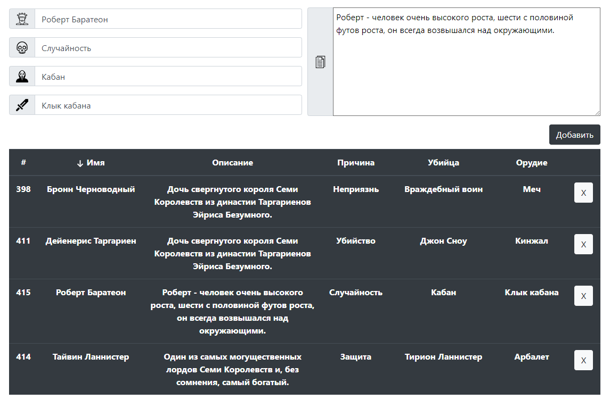

# Game of Throne database generator

Interface for adding, deleting, and sorting users, based on the characters in the novel "A Song of Ice and Fire»

 [Demo](http://эваполимер.рф/game-of-thrones/)  

<ul>
<li>Design using Bootstrap</li>
<li>Adding entries</li>
<li>Deleting records</li>
<li>Search column by column</li>
<li>General search</li>
<li>Sorting data by column</li>
<li><i>*Connecting using the Fetch API and promis to a mySQL database using the php library <a href="https://redbeanphp.com/index.php" target= "_blank">RedBeanPHP</a> with disabling the CORS policy</i></li>
</ul>

